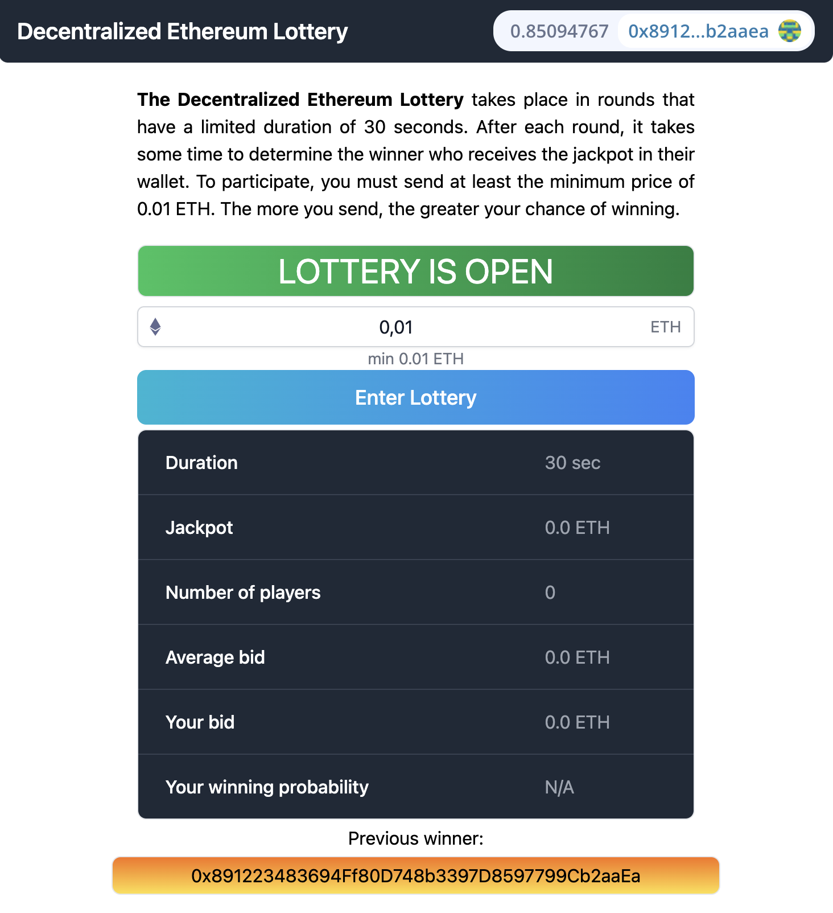

# Decentralized Ethereum Lottery Next.js

> *This is an educational project with the purpose of acquiring hands-on experience in web3 application development using smart contracts written in Solidity.*

The Decentralized Lottery project consists of 2 parts:

[Hardhat App](https://github.com/v7m/decentralized-lottery-hardhat): This component is responsible for managing smart contracts and includes deployment scripts, using the popular development environment for Ethereum smart contracts.

[Next.js App](https://github.com/v7m/decentralized-lottery-nextjs): This part serves as the frontend of the application and interacts with on-chain logic within the Ethereum ecosystem.



# Deployed App Links

- https://decentralized-eth-lottery.on.fleek.co/
- `ipfs://QmczXNikyVX4zVzPmWo6zyf5rj4a5bBPQp3qtvNj2Vo58n`

# Built with:
- Solidity
- Chainlink (VRF, Automation)
- Hardhat
- Ethers.js
- Next.js
- Moralis
- IPFS

# Getting Started

```
git clone https://github.com/v7m/decentralized-lottery-nextjs.git
cd decentralized-lottery-nextjs
yarn
yarn dev
```

# Usage

1. Run your local blockchain with the code from [Hardhat Repo](https://github.com/v7m/decentralized-lottery-hardhat) in a different terminal

```
git clone https://github.com/v7m/decentralized-lottery-hardhat.git
cd decentralized-lottery-hardhat
yarn
yarn hardhat node
```

> You can read more about how to use that repo from its [README.md](https://github.com/v7m/decentralized-lottery-hardhat/blob/main/README.md)


2. Add Hardhat network to your Metamask/wallet

- Get the `RPC_URL` of your Hardhat node (usually `http://127.0.0.1:8545/`)
- Go to your wallet and add a new network. [See instructions here.](https://metamask.zendesk.com/hc/en-us/articles/360043227612-How-to-add-a-custom-network-RPC)
  - Network Name: `Hardhat-Localhost`
  - New RPC URL: `http://127.0.0.1:8545/`
  - Chain ID: `31337`
  - Currency Symbol: `ETH` (or `GO`)
  - Block Explorer URL: `None`

In an ideal scenario, you would [import one of the accounts](https://metamask.zendesk.com/hc/en-us/articles/360015489331-How-to-import-an-Account) from Hardhat into your wallet or MetaMask.

3. Run this code in a different terminal with the code from this repo

```
yarn dev
```

4. Navigate to the user interface (UI)

Open [localhost](http://localhost:3000) and try the lottery.

# Deploy to IPFS

1. Build your static code.

```
yarn build
```

2. Export your site

```
yarn next export
```

> Please be aware that Next.js and Moralis have certain non-static features. If you choose to deviate from this repository, you may encounter errors.

3. Deploy to IPFS

- [Download IPFS desktop](https://ipfs.io/#install)
- Open your [IPFS desktop app](https://ipfs.io/)
- Select `import` and choose the folder the above step just created (should be `out`)

4. Copy the CID of the folder you pinned

5. Get [IPFS companion](https://chrome.google.com/webstore/detail/ipfs-companion/nibjojkomfdiaoajekhjakgkdhaomnch?hl=en) for your browser (or use [Brave Browser](https://brave.com/)).

6. Open `ipfs://YOUR_CID_HERE` to see IPFS app deployed


# Deploy to IPFS using Fleek

[Fleek](https://fleek.co/) offers automatic deployment when connected to your GitHub repository.


# Linting

To check linting / code formatting:
```
yarn lint
```
